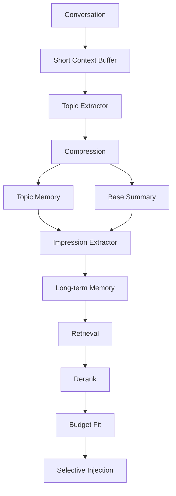

# AI Impression Memory Requirements and Design

## Summary

この文書は、AI chat の短期会話文脈とは別に管理する長期メモリ層として、Impression Memory を導入するための要件と設計を定義する。

主目的は、context window 制約の中でも次を維持することにある。

- ユーザー固有の継続性
- 未解決事項の追跡
- 高重要度事実の再利用
- 会話の分岐点や感情的イベントの保持
- 類似検索だけでない連想的想起

同時に、次の実装制約も満たす必要がある。

- 小規模 GPU/CPU 環境でも動作可能であること
- context window 消費を最適化できること
- 長期会話でも破綻しにくいこと
- topic 単位で動的想起できること
- system prompt の肥大化を防げること

この設計では、単純な会話ログ永続化ではなく、重要情報を抽出、正規化、減衰、検索、注入する memory subsystem を扱う。

## Problem Statement

現在の chat context だけでは、会話が長くなるほど次の問題が強くなる。

- 過去の重要事実が token budget から脱落する
- ユーザー固有の嗜好や進行中課題が安定して再利用されない
- 未解決の問題が会話をまたいで断絶する
- 過去との矛盾や再発トピックを十分に検知できない
- 類似文面検索だけでは、継続性、感情、未解決性、関連エンティティを加味した想起ができない

したがって、短期コンテキストとは独立した memory layer が必要になる。

## Design Principles

- 全履歴を保持しない
- 会話は共通層、トピック層、印象層、短期層へ分離して扱う
- retrieval と injection を分離し、必要時のみ再構成する
- embedding を万能視せず、summary と lightweight graph を優先する
- system prompt は固定肥大化させず、system layer の厳選 memory だけを注入する

## Goals

- 高重要度情報だけを長期保持する
- 5 層の context 構成を明示し、token budget を制御しやすくする
- impression の抽出、統合、減衰、検索、注入を一貫した規則で扱う
- semantic search だけでなく keyword、topic graph、time decay、salience rerank を併用する
- system prompt に常時注入する memory を厳しく制限し、ユーザー固有性を安定維持する
- 小規模 GPU/CPU 環境でも維持可能な軽量構成を採用する

## Non-Goals

- 全メッセージ全文の永久保存
- 感情解析だけを目的とした sentiment system
- 任意の個人情報を無制限に保持する user profiling
- 1 回の会話で生じた全観測を long-term memory 化すること

## Core Concepts

### Impression Memory

会話中で高い重要性を持ち、将来の応答品質に影響する情報を正規化した長期保持エンティティ。

例:

- ユーザーの明確な好み
- 未解決の技術課題
- 何度も再登場する関心領域
- 将来参照される可能性が高い重要事実
- 会話の分岐点になった判断や矛盾

### Impression Metadata

各 impression に付随する評価・運用情報。

必須候補:

- salience_score
- emotional_weight
- novelty_score
- future_relevance
- recurrence_count
- related_topics
- related_messages
- created_at
- last_referenced
- decay_rate
- persistence_policy

### Impression Class

初期分類は次を標準とする。

- user_preference
- unresolved_problem
- emotional_event
- identity_trait
- recurring_topic
- contradiction
- important_fact
- long_term_goal

### Persistence Policy

保持方針は次を標準とする。

- ephemeral
- session
- long_term
- pinned
- system_level

## Layer Model

```text
[conversation]
  -> [short context buffer]
  -> [topic extraction]
  -> [compression]
  -> [topic memory / base summary]
  -> [impression extraction]
  -> [long-term memory]
```

## Context Layers

### Layer 0: System Layer

用途:

- 恒久的重要情報
- ユーザー固有性
- 高 salience impression

特徴:

- 常駐
- 超小容量
- 強い選別

推奨 budget:

- 全 context window の 2% から 8%

### Layer 1: Active Conversation Layer

役割:

- 現在の会話の直近ターンを保持する
- reasoning に必要な raw context を提供する

保持対象:

- recent messages
- temporary tool results
- rolling summary

特徴:

- rolling buffer
- 時系列保持

推奨 budget:

- 全 context window の 35% から 55%

### Layer 2: Topic Memory Layer

役割:

- 直近セッション内のまとまりを topic 単位で保持する
- unresolved state を再開しやすくする

保持対象:

- topic summaries
- working memory
- unresolved states
- session-scoped preferences

特徴:

- topic selective retrieval
- 必要時のみ注入

推奨 budget:

- 全 context window の 20% から 40%

### Layer 3: Impression Layer

役割:

- 高印象記憶を保持する
- unresolved loop と recurring pattern を再注入する

保持対象:

- impression memory
- unresolved loops
- recurring patterns

特徴:

- salience 順
- 動的選択

推奨 budget:

- 全 context window の 5% から 15%

### Layer 4: Retrieval Overflow Layer

役割:

- 一時検索結果
- 外部 RAG
- 補助参照

特徴:

- 最低優先度
- context pressure 時に削除される

推奨 budget:

- 全 context window の 0% から 20%

### Long-Term Store

上記 layer への runtime 注入対象とは別に、長期保持の永続層を持つ。

保持対象:

- associative graph
- stable user model
- pinned and system-level memories

## Context Budget Manager

### Responsibilities

- token 使用量監視
- layer 別 token 制御
- 圧迫時の段階削減
- retrieval 優先順位制御

### Reduction Order

```text
overflow
  -> old topic memory
  -> low salience impressions
  -> conversation compression
  -> system layer
```

system layer は最後まで残す。

### Pressure Thresholds

- soft: 55%
- medium: 70%
- hard: 85%

### Compression Policy

- soft: 軽圧縮だけ行う
- medium: topic summary 更新を行う
- hard: retrieval only mode に寄せ、overflow と低優先注入を切る

## Functional Requirements

### FR-1 Impression Extraction

システムは、短期コンテキスト、topic、メッセージメタ情報から impression candidate を抽出できなければならない。

入力:

- recent messages
- rolling summary
- active topic labels
- message metadata

出力:

- normalized impression candidates

### FR-2 Impression Scoring

各 candidate は次の観点で score 化されなければならない。

- salience
- emotional weight
- novelty
- future relevance
- recurrence
- user-specificity
- unresolvedness

### FR-3 Impression Classification

各 candidate は少なくとも 1 つの impression class に分類されなければならない。必要なら複数 class を持てる。

### FR-4 Persistence Decision

各 candidate は persistence policy を持たなければならない。policy は class、score、privacy risk、再登場頻度に基づいて決定する。

### FR-5 Deduplication and Merge

同一意味または高重複の impression は統合されなければならない。

統合時には次を更新する。

- recurrence_count
- last_referenced
- related_topics
- related_messages
- aggregate salience

### FR-6 Dynamic Decay

impression は時間経過、未参照期間、関連 topic 消失、relevance 低下に応じて動的減衰しなければならない。

### FR-7 Hybrid Retrieval

memory retrieval は次を併用できなければならない。

- embedding retrieval
- keyword or BM25 retrieval
- topic graph traversal
- associative recall
- temporal rerank
- salience rerank

ただし retrieval は inject と同義であってはならない。候補取得後に budget fit を行い、選択注入できなければならない。

### FR-8 System-Level Injection

system-level memory は system prompt に注入可能でなければならない。ただし強い token budget と salience threshold を持たなければならない。

### FR-9 Unresolved Loop Recovery

未解決の問題や継続目標は、新規会話でも active loop として想起できなければならない。

### FR-10 Contradiction Detection

新規 input が既存 impression と矛盾する場合、contradiction candidate を生成できなければならない。

### FR-11 Budget-Aware Injection

システムは layer ごとの token budget を維持しながら、injection selection を実行できなければならない。

### FR-12 Topic-Scoped Recall

現在のトピックに関連する summary と impression だけを優先的に想起し、topic 非依存情報は base summary へ寄せられなければならない。

## Non-Functional Requirements

### NFR-1 Token Discipline

memory injection は短期コンテキストを圧迫しないこと。system-level memory は厳格な小サイズ制約を持つこと。

### NFR-2 Local-First Operation

MDV の desktop 文脈では、初期実装はローカル永続化で成立することが望ましい。

### NFR-3 Explainability

各 memory item は、なぜ保存され、なぜ想起されたかを追跡できること。

### NFR-4 Privacy Control

memory item は policy と sensitivity を持ち、削除、pin、降格、無効化ができること。

### NFR-5 Incremental Cost

候補抽出と再スコアは message append 単位で増分処理できること。

### NFR-6 Small-Hardware Viability

Raspberry Pi クラスや小規模 GPU/CPU 環境でも動作可能な軽量構成を持つこと。

### NFR-7 Graceful Degradation

embedding index や graph が弱い構成でも、summary と keyword retrieval だけで最低限破綻しないこと。

## Extraction Conditions

candidate 化の初期条件は次を推奨する。

- 高頻度再登場
- 強い感情変化
- 明示的重要発言
- 将来参照予測が高い
- ユーザー固有性が強い
- 会話分岐点になった
- 問題が未解決のまま残っている

### Suggested Heuristics

- 同一 topic が複数セッションで反復する
- 「重要」「忘れないで」「今後も」などの明示 marker がある
- preference 表明が選択・拒否に直結している
- 問題が再発し、まだ解決済みへ遷移していない
- 既存 memory と矛盾する事実が出た

## Data Model

### ImpressionRecord

```ts
type ImpressionClass =
  | 'user_preference'
  | 'unresolved_problem'
  | 'emotional_event'
  | 'identity_trait'
  | 'recurring_topic'
  | 'contradiction'
  | 'important_fact'
  | 'long_term_goal'

type PersistencePolicy =
  | 'ephemeral'
  | 'session'
  | 'long_term'
  | 'pinned'
  | 'system_level'

type ImpressionRecord = {
  id: string
  userId: string | null
  sessionId: string | null
  title: string
  canonicalText: string
  summaryText: string
  classes: ImpressionClass[]
  salienceScore: number
  emotionalWeight: number
  noveltyScore: number
  futureRelevance: number
  recurrenceCount: number
  unresolvedScore: number
  contradictionScore: number
  relatedTopicIds: string[]
  relatedMessageIds: string[]
  relatedEntityIds: string[]
  persistencePolicy: PersistencePolicy
  decayRate: number
  confidence: number
  sourceSpanCount: number
  createdAt: string
  updatedAt: string
  lastReferencedAt: string | null
  archivedAt: string | null
}
```

### Supporting Entities

```ts
type TopicNode = {
  id: string
  label: string
  summary: string
  activeScore: number
}

type MessageNode = {
  id: string
  sessionId: string
  role: 'user' | 'assistant' | 'tool'
  text: string
  createdAt: string
}

type MemoryEdge = {
  fromId: string
  toId: string
  type:
    | 'about_topic'
    | 'derived_from_message'
    | 'contradicts'
    | 'supports'
    | 'continues'
    | 'mentions_entity'
    | 'related_intent'
  weight: number
}
```

## Associative Graph Model

```text
Topic
 <-> Message
 <-> Impression
 <-> Intent
 <-> Entity
```

この graph は semantic similarity だけでは拾えない連想を補完する。

例:

- topic 経由で未解決課題へ到達する
- 同一 entity を介して preference と unresolved issue を結び直す
- 過去の contradiction を意図に紐付ける

## Retrieval Model

### Design Principle

本設計では、単純な `retrieval(query)` ではなく `memory_resonance(query, state)` を採用する。

評価対象は query 類似度だけでなく、次を含む。

- 感情
- 継続性
- 未解決性
- 連想関係
- 現在の会話状態

### Hybrid Retrieval Pipeline

```text
semantic vector search
+ keyword or BM25
+ topic graph traversal
+ time decay
+ salience rerank
```

### Injection Flow

```text
retrieve candidates
  -> salience rerank
  -> context budget fit
  -> inject selected only
```

重要なのは retrieval そのものではなく injection selection である。

### Resonance Score

初期式の例:

```text
resonance =
  semantic_similarity
+ topic_overlap
+ impression_overlap
+ recency
+ unresolved_weight
+ user_interest_score
```

実運用では class ごとに重みを変えてよい。

例:

- unresolved_problem は unresolved_score と recurrence_bonus を強くする
- user_preference は user-specificity と recurrence を強くする
- system_level は salience と stability を強くし、novelty は弱くする

## Decay Model

decay は削除そのものではなく、想起優先度の低下として扱う。

### Inputs

- 経過時間
- 未参照期間
- 関連 topic の消失
- 最新会話との relevance 低下
- policy

### Rules

- `pinned` は decay しない
- `system_level` は極めて遅い decay とし、rotation 対象として扱う
- `unresolved_problem` は解決されるまでは decay を弱くする
- `emotional_event` は emotional weight が高くても未参照が長ければ段階的に降格できる
- `ephemeral` と `session` は short or mid-term から long-term へ昇格しない限り自然消滅させる

## Topic Extraction Timing

topic extraction は毎メッセージでは行わない。

理由:

- 高コスト
- topic jitter を起こしやすい
- summary と memory の不安定化を招く

### Recommended Triggers

#### 1. Message Count Threshold

- 4 から 8 発話ごと

#### 2. Topic Shift Detection

- embedding distance の急変
- keyword divergence
- intent 変化
- 明示的な話題切替

#### 3. Context Pressure

- context 残量低下時に summary 更新と topic compression を行う

#### 4. Idle-Time Background Work

- 可能なら background summarization と topic extraction を非同期で行う

## Compression Design

### Trigger

```text
if context_usage > threshold:
  compress()
```

### Three-Stage Compression

#### 1. Base Summary

保持:

- 会話全体状態
- 共有前提
- 永続的制約
- ユーザー意図

除外:

- topic 固有詳細
- 一時的詳細
- 冗長説明

#### 2. Topic Summary

保持:

- topic 固有情報
- unresolved state
- decisions
- 継続議論

除外:

- 重複説明
- topic 無関係情報

#### 3. Impression Extraction

保持:

- 長期的重要性が高い高 salience 情報のみ

### Compression Prompt Templates

#### Base Summary Prompt

```text
以下の会話から、
トピック依存性を除いた共通文脈のみ抽出してください。

含める:
- 会話全体の前提
- 永続的制約
- ユーザー意図
- 共通知識

除外:
- 一時的詳細
- topic 固有議論
- 冗長説明

100〜300 token 以内。
```

#### Topic Summary Prompt

```text
以下の会話から、
「{topic}」に関する情報のみ圧縮してください。

保持:
- 結論
- unresolved 問題
- 重要決定
- 制約
- 継続議論

除外:
- 重複説明
- topic 無関係情報

時系列を完全保持せず、
意味的継続性を優先する。

200 token 以内。
```

#### Impression Extraction Prompt

```text
以下の会話から、
長期的重要性が高い情報のみ抽出してください。

評価基準:
- 将来参照されそうか
- ユーザー固有性
- 高頻度再登場
- unresolved 状態
- 強い印象
- 長期目標

短く箇条書きで出力。
低重要情報は無視する。
```

## System-Level Memory Control

system-level memory は user identity と stable preference を保つための特別枠とする。

```text
system level memory
  -> very small
  -> high salience only
  -> dynamic rotation
```

### Constraints

- item 数は非常に少なくする
- 高 salience かつ高 stability の item のみ許可する
- unresolved loop のように短命な item は通常 system-level に入れない
- prompt 注入前に rotation と dedupe を行う

### Initial Recommendation

- 最大 8 件
- 合計 token は context window の 2% から 8% を原則とする
- class は user_preference、identity_trait、long_term_goal、important_fact を優先

### Allowed Conditions

- 高 salience
- 長期安定
- 高頻度再出現
- ユーザー固有性が高い

### Disallowed Conditions

- 一時感情
- 一回限り
- topic 限定
- 古い衝動
- stale memory

## Prompt Injection Model

```text
System Prompt
  - identity memory
  - persistent preferences
  - critical impressions

Conversation Context
  - short context buffer
  - base summary
  - active topic memory
  - active unresolved loops
  - selected impressions

Retrieval Layer
  - vector retrieval
  - graph traversal
  - salience rerank
  - temporal rerank
```

### Injection Strategy

- system-level は常時注入候補だが強い budget 制限をかける
- long-term impression は query resonance が高いものだけを選ぶ
- unresolved loops は active topic と一致する場合に優先注入する
- 同じ事実を short-term と long-term の両方から重複注入しない

## Lightweight Deployment Profile

### Key Principle

embedding を万能視しない。

embedding だけに依存すると次が増える。

- CPU 負荷
- RAM 消費
- index 肥大
- retrieval latency

### Recommended Lightweight Stack

```text
short context
+ small summary cache
+ lightweight topic graph
+ small embedding index
```

### Recommended Embedding Models

軽量:

- bge-small
- e5-small
- nomic-embed-text

超軽量:

- MiniLM
- multilingual-e5-small

### Recommended Vector Stores

超軽量:

- SQLite + sqlite-vss
- SQLite + faiss
- qdrant local

中規模:

- Qdrant
- Weaviate

### Small-Hardware Practical Profile

Raspberry Pi や小 GPU 環境向けの現実解は次を優先する。

```text
SQLite
+ small embeddings
+ simple topic summaries
+ keyword retrieval
+ minimal graph
```

巨大 Vector DB より、軽量 summary 中心のほうが安定しやすい。

## Processing Pipeline



## Storage Design

### Recommended Baseline for MDV

初期実装は local-first を優先し、次を推奨する。

- SQLite for canonical records
- embeddings table for small vector index metadata
- adjacency tables for associative graph
- background worker for extraction and decay recomputation

理由:

- desktop app に外部依存を増やしにくい
- user-local memory と相性がよい
- backup、export、delete が扱いやすい

### Scale-Out Options

将来の外部ストア候補:

- Vector DB: Qdrant, Weaviate, pgvector
- Graph DB: Neo4j, ArangoDB

推奨方針:

- single-user desktop では SQLite baseline を優先
- multi-device sync や共有 memory を導入する段階で pgvector or Qdrant を検討
- graph traversal が高度化した段階で Neo4j or ArangoDB を検討
- 小規模環境では SQLite + summary cache + keyword retrieval を first choice とする

## Retrieval Interfaces

### Candidate APIs

```ts
type ExtractImpressionsInput = {
  sessionId: string
  recentMessages: string[]
  activeTopics: string[]
  messageMetadata: Record<string, unknown>[]
}

type RetrieveMemoryInput = {
  query: string
  activeTopics: string[]
  currentStateSummary: string
  maxItems: number
}

type RetrieveMemoryOutput = {
  systemLevel: ImpressionRecord[]
  activeLongTerm: ImpressionRecord[]
  unresolvedLoops: ImpressionRecord[]
  explanations: string[]
}
```

## Operational Policies

### Creation Policy

- candidate は score threshold を超えた場合だけ保存する
- 同一セッション内の transient observation は原則 mid-term に置く
- long-term への昇格は recurrence または future relevance を要求する
- topic 固有で短命な情報は topic summary にとどめ、system level へ上げない

### Update Policy

- 再登場時は新規作成より merge を優先する
- contradictory update は既存 fact を上書きせず contradiction edge を作る
- resolved になった unresolved_problem は archived へ遷移し、active から外す

### Deletion Policy

- user による明示削除を最優先する
- ephemeral and session policy は自動掃除対象とする
- archived memory は soft delete 後に完全削除できるようにする

## Observability

少なくとも次を記録する。

- impression created count
- impression promoted count
- impression decayed count
- retrieval hit rate
- injected token usage
- unresolved loop reopen rate
- contradiction detection count

## Risks

- 過剰保存により user model が硬直化する
- salience 推定が弱いとノイズ memory が増える
- emotion を過大評価すると誤った重要度学習になる
- graph が肥大化すると retrieval cost が上がる
- system-level memory を増やしすぎると短期 reasoning を圧迫する
- topic extraction を毎メッセージで回すと jitter とコストが悪化する
- overflow layer を切らないと external RAG が短期会話を圧迫する

## Phased Rollout

### Phase 1

- rolling short context
- basic summarizer
- topic extraction
- topic summaries
- budget manager

### Phase 2

- impression memory
- hybrid retrieval
- contradiction detection
- explanation and observability

### Phase 3

- associative graph
- resonance retrieval
- user-visible memory management UI
- multi-device sync or external store evaluation

## Open Questions

- user-visible な memory 編集 UI をどの段階で入れるか
- privacy-sensitive memory を自動検出して long-term 保持を抑制するか
- impression extraction を rule-based から model-assisted にどこまで移すか
- system-level memory の token budget を固定値にするか、model window に応じて動的化するか

## Decision Summary

- impression memory は context window 制約回避のために必要な long-term layer として導入する
- architecture は system、active conversation、topic memory、impression、overflow の 5 層 runtime 構成とする
- retrieval は hybrid かつ resonance-based にするが、重要なのは budget-aware injection selection とする
- system-level memory は小さく、高 salience のみ許可する
- 初期実装は local-first かつ lightweight を優先し、SQLite と small summary cache を中核にする