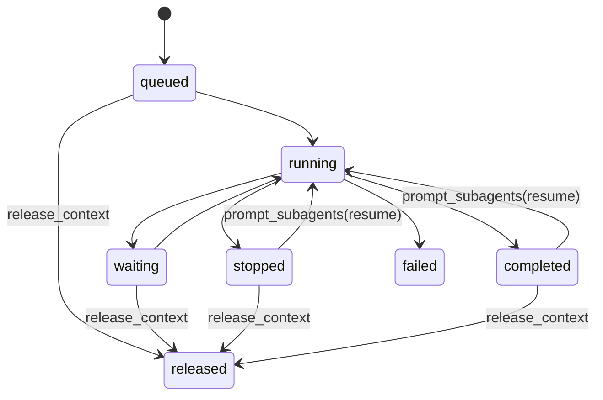

# AI Subagent Tool Design

## Summary

この文書は、MDV の AI tool surface に subagent orchestration を導入するための設計を定義する。

目的は、main AI から切り離された独立の agent runtime を持ちつつ、親 agent から tool として起動、操作、待機できるようにすることにある。

初期スコープでは custom agent 機能は実装しない。ただし将来の profile 差し替え余地は contract に残す。

## Goals

- subagent を tool 経由で起動できること
- subagent に追加 prompt を送れること
- 実行停止と context 解放を別操作として扱えること
- 動作中または保持中の subagent を一覧できること
- 複数 ID 指定で待機できること
- subagent の最終応答は親 agent への tool result として返ること
- root agent と subagent が同じ agent runtime 契約上で動くこと

## Non-Goals For First Slice

- custom agent profile の実装
- subagent 専用 UI window
- subagent 同士の直接通信
- 永続化された subagent memory
- agent tree の可視化 UI

## Core Requirement

subagent は「main AI の特別ケース」ではなく、同じ agent runtime の 1 instance として扱う。

そのうえで user-facing 回答を返す root agent だけを UI に接続し、subagent の結果は親 agent にだけ返す。

## Architecture Boundary

必要な分離は次の 3 層。

### 1. Agent Runtime

責務:

- transcript 保持
- tool loop 実行
- iteration scheduling
- stop / resume / completion 管理
- retained context 管理

### 2. Tool Runtime

責務:

- AI tool 定義の登録
- tool schema / validation / execution
- parent agent / subagent 非依存の実行面

### 3. UI / User Boundary

責務:

- root agent への user prompt 送信
- root agent reply のみ transcript 表示
- subagent result は親 agent へ返し、必要なら親が user-facing に要約する

この分離により、AI ツールは agent 形式で root / sub を問わず独立に切り離し可能になる。

## Agent Identity Model

```ts
type AgentId = string

type AgentKind = 'root' | 'subagent'

type AgentStatus =
  | 'queued'
  | 'running'
  | 'waiting'
  | 'completed'
  | 'stopped'
  | 'failed'
  | 'released'

interface AgentRecord {
  agentId: AgentId
  kind: AgentKind
  parentAgentId: AgentId | null
  status: AgentStatus
  createdAt: string
  updatedAt: string
  lastIterationStartedAt: string | null
  lastIterationCompletedAt: string | null
  initialPrompt: string
  pendingPrompts: string[]
  retainedContext: boolean
  resultSummary: string | null
  errorSummary: string | null
  agentProfileId: string | null
}
```

注記:

- `agentProfileId` は予約 field であり、初期実装では `null` か default のみ許可する
- root agent も `AgentRecord` として扱うが、UI 接続は root だけが持つ

## Proposed Tool Surface

初期設計では次の 5 つを tool contract とする。

### `start_subagent`

用途:

- subagent を新規起動する

入力:

- `prompt`: 初期 prompt
- `goal` optional: 親 agent が期待する成果の短い説明
- `agentProfileId` optional reserved: 将来の custom agent 用予約 field
- `contextPolicy` optional: `inherit` | `fresh`

返却:

- `agentId`
- `status`
- `acceptedAgentProfileId`
- `parentAgentId`

初期方針:

- custom agent は未実装なので `agentProfileId` を受けても default に正規化する
- transcript と tool runtime は subagent 用に独立インスタンスを作る

### `prompt_subagents`

用途:

- 既存 subagent に追加 prompt を送る

入力:

- `agentIds`: 対象 ID 配列
- `prompt`: 追加 prompt
- `resumeIfStopped` optional: default `true`

動作:

- `running` の場合は次イテレーション queue に prompt を差し込む
- `waiting` の場合も queue に積む
- `stopped` または `completed` で retained context が残っていれば prompt で再開する
- `released` なら失敗させ、再起動を要求する

返却:

- agent ごとの accepted / rejected 結果
- queue 状態

### `control_subagents`

用途:

- subagent を停止または context 解放する

入力:

- `agentIds`: 対象 ID 配列
- `action`: `stop` | `release_context`

動作:

- `stop` は現在 iteration の次境界で停止する cooperative stop
- `release_context` は retained transcript / pending prompt / tool context を破棄し、再開不能にする

返却:

- agent ごとの実行結果
- 直後 status

### `list_subagents`

用途:

- 実行中または保持中の subagent を列挙する

入力:

- `agentIds` optional
- `status` optional
- `parentAgentId` optional

返却:

- `agents[]`
- 最低限 `agentId`, `status`, `parentAgentId`, `createdAt`, `updatedAt`, `retainedContext`, `resultSummary`

### `wait_subagents`

用途:

- 指定 subagent の状態変化を待機する

入力:

- `agentIds`: 対象 ID 配列
- `until` optional: `idle_or_terminal` | `completed` | `stopped`
- `timeoutMs` optional

返却:

- agent ごとの最終観測 state
- completion / stop / timeout の区別
- completed の場合は最終 result summary

注記:

- user 要件に合わせ、待機対象は常に ID 指定とし、複数指定を許可する

## State Transition Model



## Result Routing Rule

最重要ルールは次の 2 点。

- root agent の assistant reply だけが user-facing reply になる
- subagent の assistant reply は親 agent への tool result になる

そのため、subagent 自体は main AI と同じように tool を使って動けるが、subagent の最終回答はそのまま user へ返さない。

## Tool Independence Requirement

この要件のため、AI tool は次の形で切り離す必要がある。

```text
AgentRuntime
  -> ToolRuntime
  -> ModelAdapter
  -> SessionState

RootAgentUI
  -> AgentRuntime(root)

ParentAgent
  -> Tool call
  -> AgentRuntime(subagent)
```

意味:

- tool 実行面は parent agent 固有であってはならない
- root / subagent どちらでも同じ tool registry を使える必要がある
- user-facing reply の routing だけを root 側責務として分離する

## Scheduling Model

- subagent は cooperative iteration 単位で進む
- `prompt_subagents` は running agent に対して current iteration を中断せず、次 iteration に差し込む
- `stop` も強制 kill ではなく next safe boundary で停止する
- `wait_subagents` は polling tool ではなく runtime event 待機に寄せる

## Failure Model

- start 失敗は `agentId` 未発行で返す
- prompt 失敗は agent ごとに partial failure を返す
- released agent への prompt は invalid state error にする
- stop 済みでも retained context がある限り prompt で resume 可能にする
- context 解放後の再利用は不可とし、新規 start を要求する

## Future Extension Points

- `agentProfileId` による custom agent 切り替え
- agent ごとの tool permission narrowing
- agent ごとの model override
- parent-child-grandchild の tree 表示
- retained context の容量上限と GC

## Recommended Implementation Order

1. `AgentRuntime` と root agent の内部抽象化
2. subagent registry と status model
3. `start_subagent`
4. `prompt_subagents` / `control_subagents`
5. `list_subagents` / `wait_subagents`
6. root reply routing と subagent tool result routing の分離
